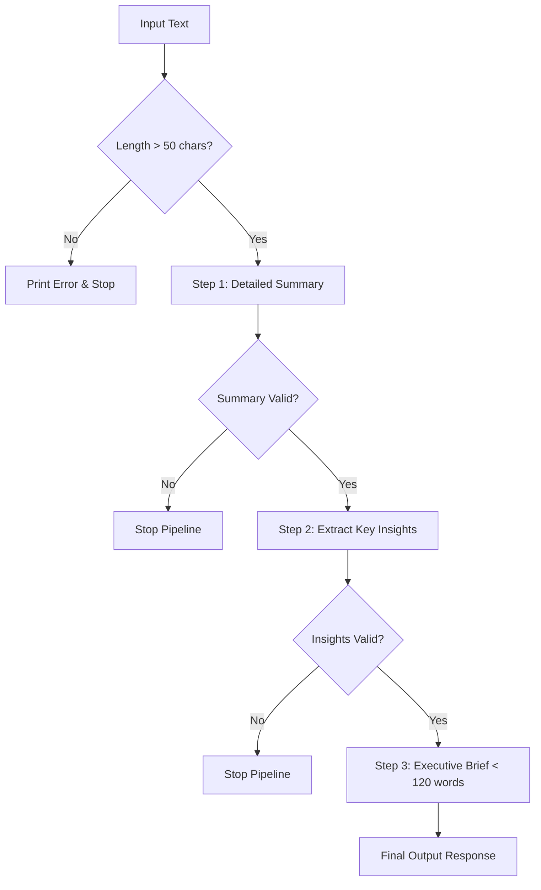
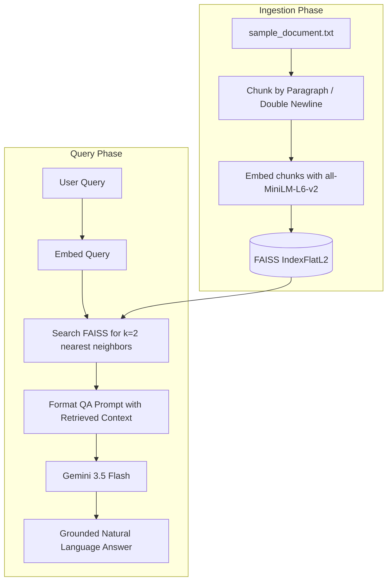
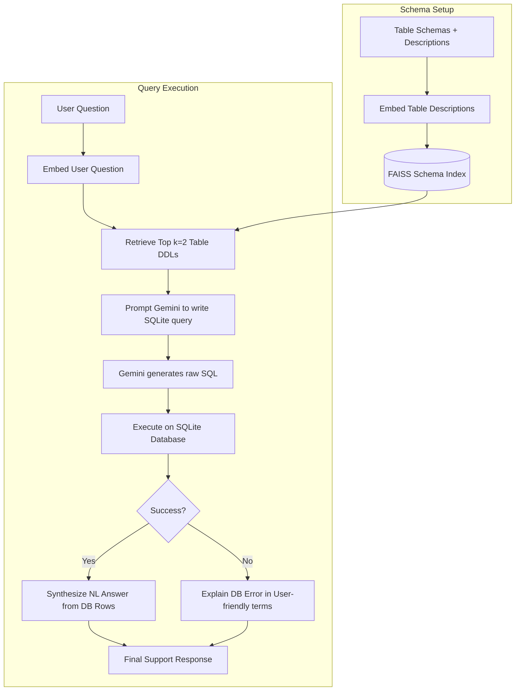

# Agentic-AI-Laboratory-Experiment--179
# Advanced LLM & Agentic AI Experiments Report

This document provides a comprehensive analysis, architectural breakdown, and comparison of the LLM and Agentic AI experiments conducted in the workspace. These experiments range from basic single-prompt setups to advanced, production-oriented pipelines integrating vector databases (FAISS), sentence embeddings, relational databases (SQLite), and agentic multi-step planning.

---

## 1. Overview of the Experiments

The experiments are divided into two main environments:
1. **Basic/Educational Implementations** (`agentic ai/llm_assignments/`): Focused on demonstrating core concepts (Prompting, Chaining, Planning, basic RAG).
2. **Production-Ready/Advanced Workflows** (`advanced_workflows/`): Incorporating validation checks, semantic indexing of database schemas, strict grounding, and error-handling mechanisms.

### Experiment Catalog

| Experiment | Target File | Core Objective | Primary Technologies | Complexity |
| :--- | :--- | :--- | :--- | :--- |
| **01. Simple LLM Call** | [q1_llm_workflow.py](q1_llm_workflow.py) | Establish basic connection and zero-shot question answering. | `google-genai` (Gemini 3.5 Flash) | Basic |
| **02. Prompt Chaining (Basic)** | `q2_prompt_chaining.py` | Sequentially generate a summary, key points, and related questions. | `google-genai` | Basic |
| **03. Prompt Chaining (Prod)** | [prompt_chaining.py](prompt_chaining.py) | Summarize, extract insights, and synthesize an executive brief with length validations. | `google-genai` | Medium |
| **04. Agentic AI (Planning)** | `q3_agentic_ai.py` | Implement a Plan-then-Execute pattern where the model designs and executes a checklist. | `google-genai` | Medium |
| **05. RAG QA (Basic)** | `q4_rag_qa.py` | Basic QA retrieval using paragraph chunks and 1-NN FAISS search on static data. | `sentence-transformers`, `faiss`, `google-genai` | Medium |
| **06. RAG QA (Prod)** | [rag_qa.py](rag_qa.py) | Context-grounded Q&A on detailed product documentation using 2-NN retrieval and fallback guards. | `sentence-transformers`, `faiss`, `google-genai` | High |
| **07. Text-to-SQL Engine** | [text_to_sql.py](text_to_sql.py) | Semantic schema retrieval, SQLite generation/execution, and natural language response synthesis. | `sentence-transformers`, `faiss`, `sqlite3`, `google-genai` | High |
| **08. SQL Agent with Tool Use** | `Experiment 4/sql agent with tool/sql_agent.py` | ReAct reasoning loop utilizing database tools to dynamically fetch schemas and query SQLite. | `sqlite3`, `google-genai` | High |
| **09. Multi-Agent SDR System** | `Experiment 5/multi_agent_sdr/sdr_system.py` | Lead generation, automated qualification against ICP, and custom B2B cold emailing. | `google-genai` | High |
| **10. Policy Compliance Agent** | `Experiment 6/policy_compliance/compliance_agent.py` | Rule-based and semantic LLM audit checks of agent conversation logs for safety compliance. | `google-genai` | High |
| **11. Deep Research Agent Workflow** | `Experiment 7/deep_research_agent/research_workflow.py` | Planning, drafting, self-reflection critique, and iterative refinement agent loop. | `google-genai` | High |
| **12. Multimodal Retrieval & VQA** | `Experiment 8/image_retrieval_vqa/multimodal_pipeline.py` | Dynamic PIL image generator, multimodal image caption indexing, and visual QA pipeline. | `google-genai`, `pillow` | High |
| **13. Reasoning Benchmarking** | `Experiment 9/reasoning_benchmarking/benchmarking.py` | Compare Zero-Shot, Few-Shot, CoT, and Self-Consistency prompting accuracy/latency. | `google-genai`, `matplotlib` | High |
| **14. Fine-Tuning Simulation** | `Experiment 10/fine_tuning_simulation/fine_tuning_experiment.py` | Instruction data prep (JSONL formatting), training loss curve plotting, base vs tuned evaluation. | `google-genai`, `matplotlib` | High |
| **15. Model Optimization** | `Experiment 11/model_optimization/optimization_experiment.py` | Post-training weight quantization (FP32 to INT8) and student-teacher knowledge distillation. | `scikit-learn`, `matplotlib` | High |
| **16. Capstone Project** | `Experiment 12/capstone_project/main.py` | End-to-end Enterprise Support System combining SQLite query tool, RAG, safety checker, and FastAPI dashboard. | `fastapi`, `google-genai` | High |

---

## 2. Deep Dive: Architectural Workflows

Below are the detailed workflows for the key architectural patterns tested in these experiments.

### A. Prompt Chaining Pipeline (Production-Ready)
Prompt chaining decomposes a complex task into multiple, smaller prompts where the output of one step becomes the input to the next. The production script includes validation checks to prevent failures from propagating downstream.



### B. Retrieval-Augmented Generation (RAG) System
RAG overcomes LLM context limitations and knowledge cutoff dates by dynamically retrieving relevant document parts from a vector space before querying the LLM.



### C. Text-to-SQL Query Engine with Semantic Schema Selection
Instead of passing the entire database schema to the LLM context (which is expensive and error-prone), this engine retrieves only the relevant tables using vector similarity on table descriptions.



---

## 3. Comparative Analysis: Basic vs. Advanced Implementations

### Prompt Chaining
- **Basic (`q2_prompt_chaining.py`)**:
  - Prompts are hardcoded for direct topics.
  - Generates three outputs in parallel pipelines without validating if previous steps returned empty or low-quality text.
- **Advanced (`prompt_chaining.py`)**:
  - Uses a modular `generate_step` helper function.
  - Implements strict input length guards (`len(text) < 50`).
  - Performs validation checks on intermediate outputs before proceeding to subsequent steps.
  - Enforces strict constraints in the prompt (e.g., "single cohesive paragraph of no more than 120 words focusing on strategic impact").

### Retrieval-Augmented Generation (RAG)
- **Basic (`q4_rag_qa.py`)**:
  - Chunks text naively without filtering empty blocks.
  - Retrieves only the single most similar chunk ($k=1$).
  - Simple prompt instruction without system behavior constraints.
- **Advanced (`rag_qa.py`)**:
  - Cleans input data, filtering out title markers and empty space.
  - Retrieves the top $k=2$ chunks for a broader context.
  - Prints distance metrics in console for debugging retrieval precision.
  - Adds a negative constraint guard: *"If the answer cannot be found in the context, respond with 'I cannot answer this based on the provided document.'"* to prevent hallucinations.

---

## 4. Key Lessons & Implementation Guidelines

1. **Hallucination Prevention**:
   Strict negative prompts (e.g., "Answer ONLY from the provided context") combined with precise vector retrieval dramatically decrease model confabulations.
2. **Context Contextualization**:
   Chunking files on structural boundaries (like double-newlines or Markdown headers) keeps semantic ideas cohesive compared to naive character or token chunking.
3. **Database Security and Safety**:
   When implementing Text-to-SQL, the LLM should only have read-only access (via database permissions) to prevent SQL injection or accidental data modification.
4. **Intermediate State Validations**:
   In complex chains, checking that intermediate steps succeeded and met length or pattern criteria ensures the robustness of the final output.

---

## 5. Local Setup & Execution Guide

### Prerequisites
Install the required packages in your Python virtual environment:
```bash
pip install google-genai sentence-transformers faiss-cpu numpy
```

### Database Initialization
Before running the Text-to-SQL script, set up the SQLite database:
```bash
python setup_db.py
```

### Running the Workflows
1. **To run the advanced summarization pipeline**:
   ```bash
   python prompt_chaining.py
   ```
2. **To run the grounded QA assistant**:
   ```bash
   python rag_qa.py
   ```
3. **To query the database using natural language**:
   ```bash
   python "Experiment 1/text to sql workflow/text_to_sql.py"
   ```
4. **To run the ReAct-based SQL Agent & generate the PDF report**:
   ```bash
   python "Experiment 4/sql agent with tool/generate_pdf.py"
   ```
5. **To run the multi-agent SDR system**:
   ```bash
   python "Experiment 5/multi_agent_sdr/sdr_system.py"
   ```
6. **To run the policy compliance evaluator**:
   ```bash
   python "Experiment 6/policy_compliance/compliance_agent.py"
   ```
7. **To run the deep research agent workflow**:
   ```bash
   python "Experiment 7/deep_research_agent/research_workflow.py"
   ```
8. **To run the multimodal image retrieval & VQA pipeline**:
   ```bash
   python "Experiment 8/image_retrieval_vqa/multimodal_pipeline.py"
   ```
9. **To run the reasoning model prompting benchmarking**:
   ```bash
   python "Experiment 9/reasoning_benchmarking/benchmarking.py"
   ```
10. **To run the fine-tuning domain adaptation simulator**:
    ```bash
    python "Experiment 10/fine_tuning_simulation/fine_tuning_experiment.py"
    ```
11. **To run the model optimization (quantization + distillation) experiment**:
    ```bash
    python "Experiment 11/model_optimization/optimization_experiment.py"
    ```
12. **To launch the FastAPI Capstone Dev Server**:
    ```bash
    python "Experiment 12/capstone_project/run_capstone.py"
    ```

---

## 6. Verified Outputs (Screenshots)

Below are the console outputs of each workflow, captured programmatically upon execution:

### 1. Database Initialization (`setup_db.py`)


### 2. Simple LLM Call (`q1_llm_workflow.py`)


### 3. Prompt Chaining Summarization (`prompt_chaining.py`)


### 4. RAG QA Assistant (`rag_qa.py`)


### 5. Text-to-SQL Query Engine (`text_to_sql.py`)


### 6. Multi-Agent SDR System (`sdr_system.py`)


### 7. Policy Compliance Agent (`compliance_agent.py`)


### 8. Deep Research Agent Workflow (`research_workflow.py`)


### 9. Multimodal Retrieval & VQA (`multimodal_pipeline.py`)


### 10. Reasoning Model Benchmarking (`benchmarking.py`)


### 11. Fine-Tuning Simulation (`fine_tuning_experiment.py`)


### 12. Model Optimization Experiment (`optimization_experiment.py`)


### 13. Capstone Project Portal (`main.py`)

